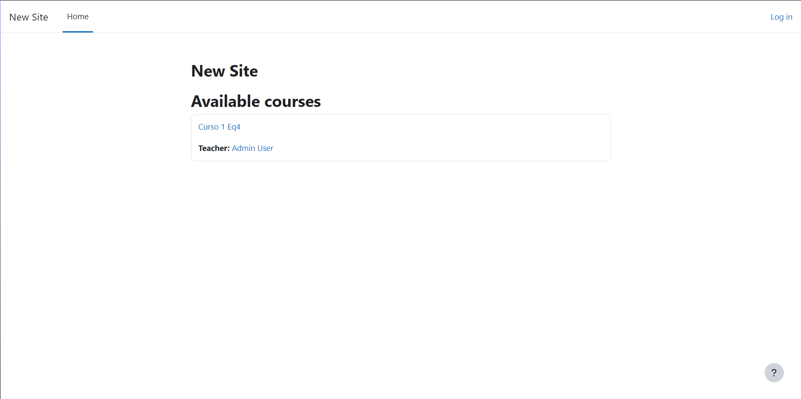
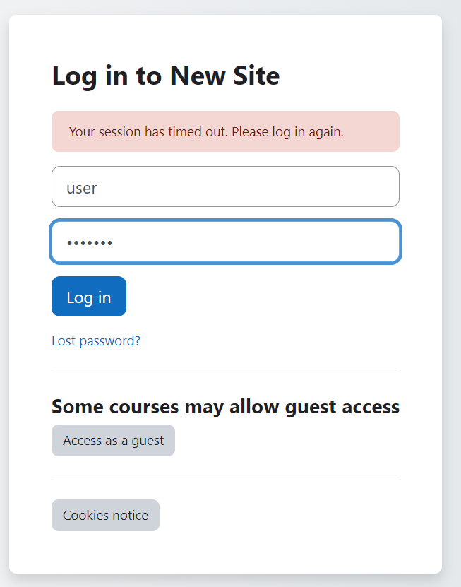
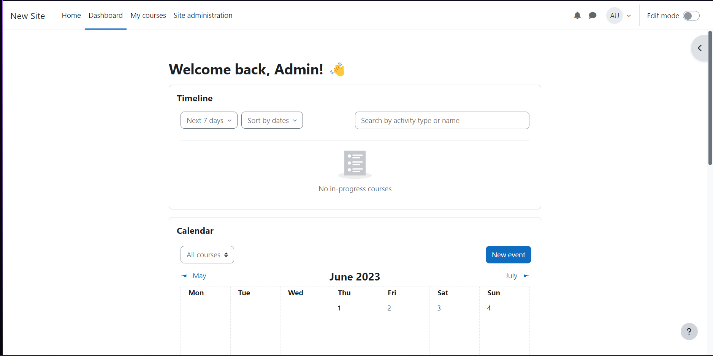

# Instalacion de Moodle-Equipo4

## Moodle y dependencias
- Instalación con docker-compose 

## Usuarios y Contraseñas que se deben cambiar en el archivo docker-compose.yml
- MARIADB_USER=bn_moodle
- MARIADB_PASSWORD=bitnami

### Correr localmente usando docker

1. Clonar el repositorio al directorio local de instalación
git clone https://github.com/Ace28w/Moodle-Equipo4.git

2. Para correr los contenedores

cd Moodle-Equipo4

docker-compose up

3. Para detener los contenedores

$docker-compose stop

# Paso 1) Correr Moodle

- http://TuIP:80/
- Usuario: user
- Password: bitnami

# Paso 2) Entrar en nuestro Moodle

- Accediendo a nuestro moodle desde nuestra IP nos vamos a log in

- Ya dentro podemos nuestras credenciales apra entrar en modo administrador que se menciona en el paso 1

- Ahora vemos que hemos iniciado en modo administrador a nuestro moodle

