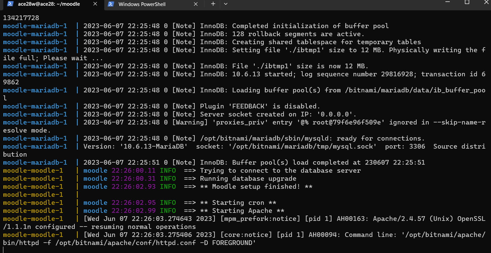
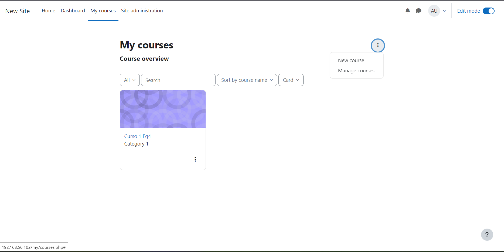
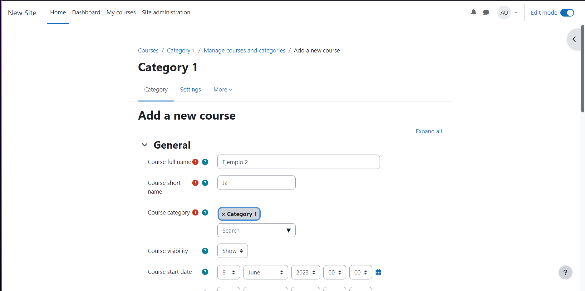
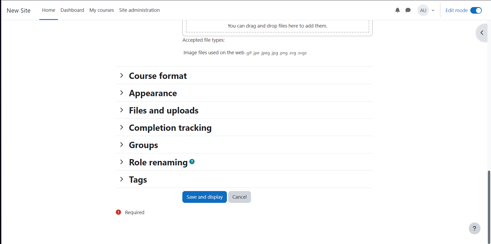
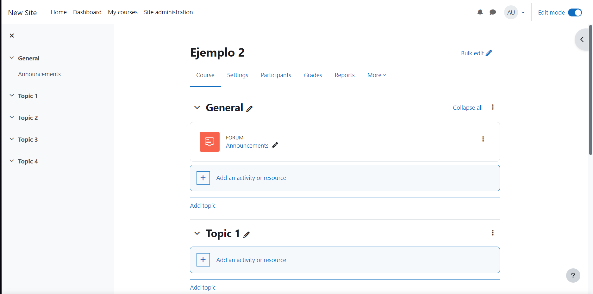
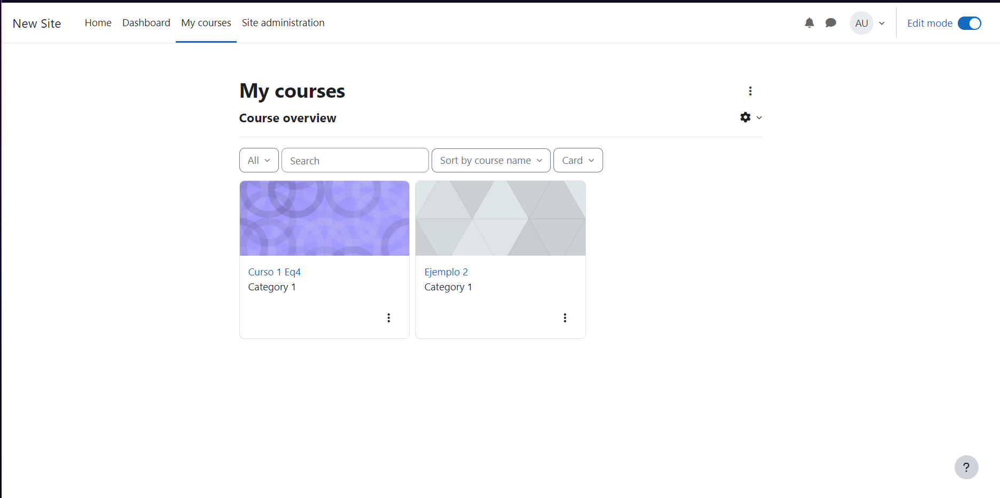

# Instalación de Moodle-Equipo4

## Moodle y dependencias
- Instalación con docker-compose 

## Usuarios y Contraseñas que se deben cambiar en el archivo docker-compose.yml
- MARIADB_USER=bn_moodle
- MARIADB_PASSWORD=bitnami

### Correr localmente usando docker

1. Clonar el repositorio al directorio local de instalación donde trabajemos nuestro docker
git clone https://github.com/Ace28w/Moodle-Equipo4.git

2. Para correr los contenedores

cd Moodle-Equipo4

- Consideración a tomar

--> Si no esta instalado el docker compose lo puedes descargar e instalar con el siguiente comando:

sudo apt  install docker-compose

--> Como recomendación apagar contenedores docker que estén en ejecución con:

docker stop "ID"

- Ahora con el siguiente comando lo podemos levantar

docker-compose up

- Para saber que ya esté en funcionamiento deberá aparecer el FOREGROUND, como vemos en la imagen de abajo

3. Para detener los contenedores

$docker-compose stop

# Paso 1) Correr Moodle

- http://TuIP:80/ --> Cambiamos la IP por la nuestra
- Usuario: user
- Password: bitnami

# Paso 2) Entrar en nuestro Moodle

- Accediendo a nuestro moodle desde nuestra IP nos vamos a log in

- Ya dentro podemos nuestras credenciales para entrar en modo administrador que se menciona en el paso 1

- Ahora vemos que hemos iniciado en modo administrador a nuestro moodle

# Paso3) Creación de un curso

- Como primer paso habilitamos el modo edición y nos vamos en my courses
- En los 3 puntos estará para agregar un nuevo curso

- Entonces llenamos los datos necesarios como el nombre que queramos

- Bajamos hasta el final y vemos que esta confirmar, le damos click

- Ahora vemos que estaos dentro del curso y podremos agregar las actividades entre varias cosas

- Ahora si nos vamos en my courses podemos ver que se encuentra el que teníamos y el nuevo, donde acá aparecen todos nuestros cursos creados

